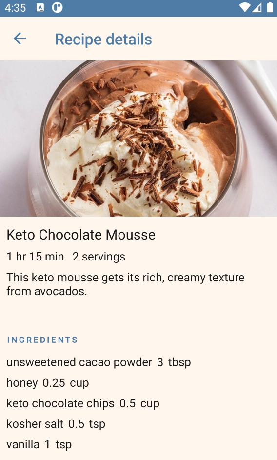

<!-- PROJECT LOGO -->
 

  

<h3 align="center">EpicurePal</h3>

  

    Android (CRUD) app to share your favorite recipe with others.
  

<!-- TABLE OF CONTENTS -->

  
Table of Contents

  <ol>
    <li>
      <a href="#about-the-project">About The Project</a>
    </li>
    <li><a href="#demo">Demo</a></li>
  </ol>

<!-- ABOUT THE PROJECT -->
## About The Project

This project was built using Xamarin Forms and interacts with my Recipe API.
Users can register and login, add/edit/delete recipes, leave reviews.
UI uses components from syncfusion (tabviews, listviews, swiping)
 
 

 

(<a href="#top">back to top</a>)

<!-- USAGE EXAMPLES -->
## Demo

Login Page

Details Page

Recipes Page

Adding Recipe

(<a href="#top">back to top</a>)

